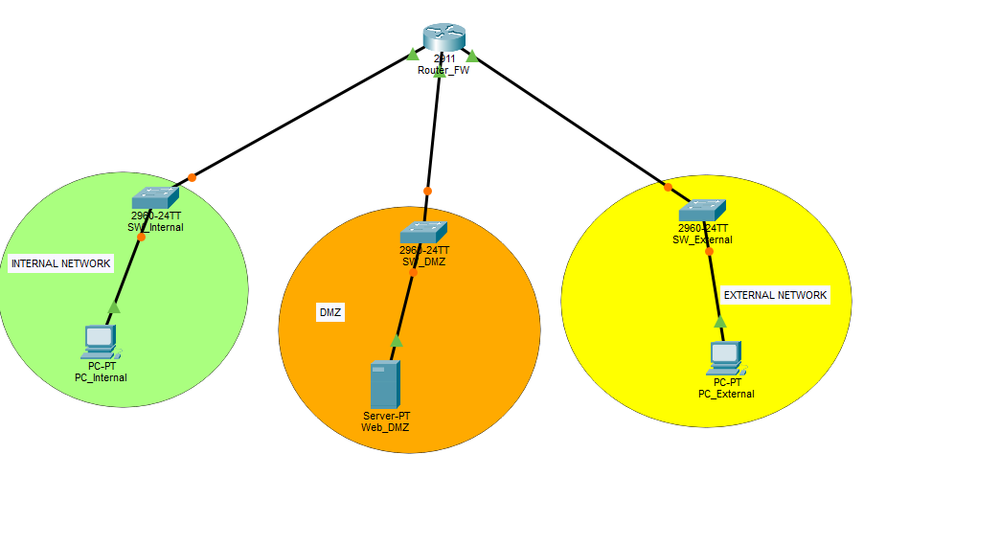

# Informe de configuración de DMZ con Cisco Packet Tracer


### 1. Objetivo del laboratorio


Se pretende Configurar una DMZ (Desmilitarized Zone) empleando un router Cisco ISR, aplicado a una red NAT y usando ACLs (Acces-Control List) para controlar el tráfico entre LAN, DMZ y red externa que permite el acceso a internet.

---

### 2. Topología implementada

>

- Cantidad de redes: 1
- Dispositivos usados: 3
- Breve descripción de la función de cada zona (LAN, DMZ, Externa).


### 3. Plan de direccionamiento IP

Completa la tabla con las IPs asignadas (puedes copiarla del enunciado si no cambió).

| Dispositivo             | IP              | Máscara           | Gateway           |
|-------------------------|------------------|-------------------|-------------------|
| PC_Internal             | 192.168.1.10     | 255.255.255.0     | 192.168.1.1       |
| Server_DMZ              | 192.168.2.10     | 255.255.255.0     | 192.168.2.1       |
| PC_External             | 192.168.3.10     | 255.255.255.0     | 192.168.3.1       |
| Router_FW Gi0/0 (LAN)   | 192.168.1.1      | 255.255.255.0     |                   |
| Router_FW Gi0/1 (DMZ)   | 192.168.2.1      | 255.255.255.0     |                   |
| Router_FW Gi0/2 (Ext)   | 192.168.3.1      | 255.255.255.0     |                   |


### 4. Configuración aplicada (resumen)

> Se crearon las ACL desde el pripio terminal de Router de la siguiente forma:

Permite el acceso al servidor y bloquea Pings y otros ataques.
```bash
Router(config)# access-list 100 permit tcp any host 192.168.3.1 eq 80
```
Nos permite respuestas a conexiones ya iniciadas (permite cargar la web en la LAN)
```bash
Router(config)# access-list 101 permit tcp 192.168.2.0 0.0.0.255 192.168.1.0 0.0.0.255 established
```
Deniega cualquier otro intento de la DMZ de entrar a la LAN
```bash
Router(config)# access-list 101 deny ip 192.168.2.0 0.0.0.255 192.168.1.0 0.0.0.255
```
Permite que la DMZ salga a Internet (para actualizaciones o DNS)
```bash
Router(config)# access-list 101 permit ip any any
```
(Añade las reglas a los puertos correspondientes)
```bash
Router(config)# interface GigabitEthernet0/2
Router(config-if)# ip access-group 100 in
```
```bash
Router(config)# interface GigabitEthernet0/1
Router(config-if)# ip access-group 101 in
```


### 5. Verificaciones realizadas

> Describe las pruebas y su resultado. Incluye capturas o salidas de comandos si se puede.

- `ping` desde PC_Internal al router: ✅
- Acceso web desde PC_External: ✅
- Bloqueo de acceso desde DMZ a LAN: ✅


### 6. Conclusiones y recomendaciones

La implementacion de Reglas es vital para el control de acceso a puntos criticos de la infraestructura, estas claves establecidas dentro del Router regulan las peticiones internas y externas del servidor, bloqueando peticiones no escenciales, ni reguladas al sistema. añadiendo capas de seguridad extra para reducir el riesgo de ataques 


### 7. Capturas de evidencia

[Documentacion Evidencias](EvidenciasDMZ.pdf)
